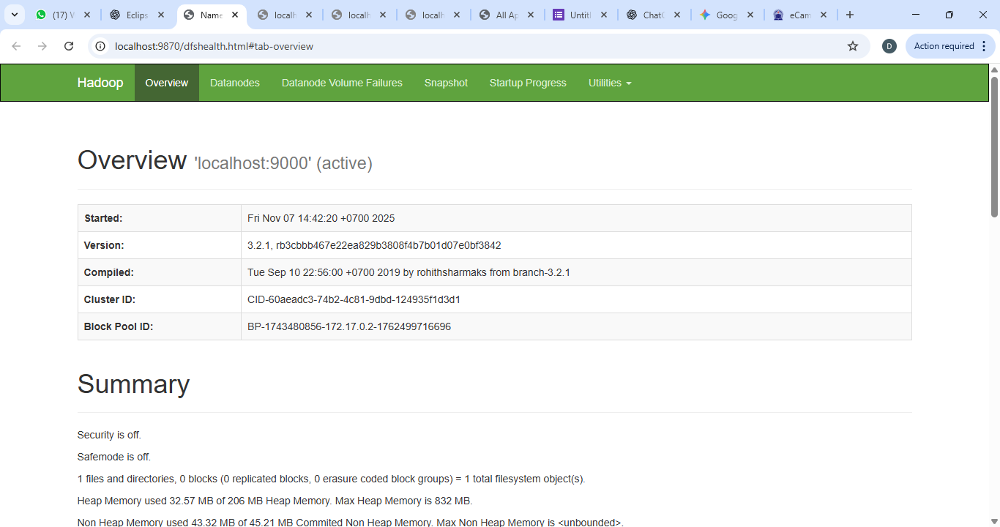
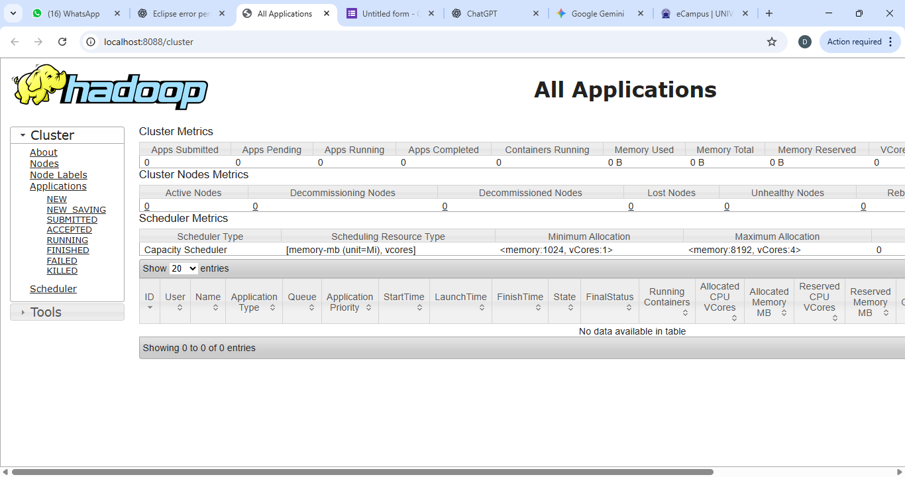

# Praktikum1_HDFS
# Praktikum2,3,4 🕓 placeholder
# 🚀 Hadoop HDFS & YARN – Praktikum Big Data

Praktikum ini membahas instalasi dan konfigurasi **Hadoop Distributed File System (HDFS)** serta **YARN** menggunakan Docker Container.
Hasil akhirnya: sistem Hadoop berhasil berjalan dan dapat diakses melalui browser di `localhost:9870` dan `localhost:8088`.

---

## 👩‍💻 Identitas Mahasiswa

| Nama                    | Kelas    | Mata Kuliah | Dosen Pengampu               |
| ----------------------- | -------- | ----------- | --------------               |
| **Dede Syifa Sifriani** | TI.23.C3 | Big Data    | Agung Nugroho, S.Kom., M.Kom |

---

## 🧠 Tujuan

* Memahami konsep penyimpanan data terdistribusi pada Hadoop.
* Melakukan instalasi Hadoop di lingkungan container.
* Menjalankan dan memverifikasi **HDFS** serta **YARN**.
* Mengakses antarmuka web Hadoop.

---

## ⚙️ Teknologi yang Digunakan

| Komponen                                      | Keterangan                         |
| --------------------------------------------- | ---------------------------------- |
| 🐳 **Docker**                                 | Menjalankan Hadoop dalam container |
| ☕ **OpenJDK 8**                               | Java environment untuk Hadoop      |
| 🗂️ **HDFS (Hadoop Distributed File System)** | Sistem file terdistribusi          |
| 🔄 **YARN (Yet Another Resource Negotiator)** | Pengatur resource dan job          |
| 💻 **Host OS**                                | Windows 10 + WSL2 Ubuntu           |

---

## 🧩 Langkah-Langkah Praktikum

### 1️⃣ Jalankan Docker dan Pull Image Hadoop

```bash
docker pull bde2020/hadoop-namenode:2.0.0-hadoop3.2.1-java8
```

### 2️⃣ Buat dan Jalankan Container

```bash
docker run -it -p 9870:9870 -p 8088:8088 --name hadoop-single bde2020/hadoop-namenode:2.0.0-hadoop3.2.1-java8 bash
```

### 3️⃣ Aktifkan SSH di Container

```bash
apt-get update
apt-get install -y openssh-server openssh-client
service ssh start
```

### 4️⃣ Tambahkan Environment Variable di `~/.bashrc`

```bash
export HDFS_NAMENODE_USER=root
export HDFS_DATANODE_USER=root
export HDFS_SECONDARYNAMENODE_USER=root
export YARN_RESOURCEMANAGER_USER=root
export YARN_NODEMANAGER_USER=root
```

Lalu jalankan:

```bash
source ~/.bashrc
```

### 5️⃣ Format HDFS

```bash
hdfs namenode -format
```

### 6️⃣ Jalankan HDFS & YARN

```bash
start-dfs.sh
start-yarn.sh
```

### 7️⃣ Cek Proses Hadoop Aktif

```bash
jps
```

Hasil yang diharapkan:

```
NameNode
DataNode
SecondaryNameNode
ResourceManager
Jps
```

---

## 🌐 Akses Web UI

| Komponen                       | URL                                            | Fungsi                   |
| ------------------------------ | ---------------------------------------------- | ------------------------ |
| 🗂️ **HDFS NameNode UI**       | [http://localhost:9870](http://localhost:9870) | Monitoring status HDFS   |
| 🔄 **YARN ResourceManager UI** | [http://localhost:8088](http://localhost:8088) | Monitoring job & cluster |

---

## ⚠️ Troubleshooting Umum

| Error                                                        | Penyebab                         | Solusi                                                                             |
| ------------------------------------------------------------ | -------------------------------- | ---------------------------------------------------------------------------------- |
| `ssh: connect to host localhost port 22: Connection refused` | SSH belum aktif                  | Jalankan `service ssh start`                                                       |
| `Permission denied (publickey,password)`                     | Belum setup SSH key              | Jalankan `ssh-keygen -t rsa` dan `cat ~/.ssh/id_rsa.pub >> ~/.ssh/authorized_keys` |
| `ERROR: Attempting to operate on hdfs namenode as root`      | Variabel user Hadoop belum diset | Tambahkan export di `.bashrc`                                                      |
| `namenode needs formatting`                                  | HDFS belum diformat              | Jalankan `hdfs namenode -format`                                                   |

---

## 📸 Hasil Akhir (Tambahkan Screenshot)

1. ✅ Output `jps` menampilkan semua komponen aktif.
2. 🌐 Tampilan **HDFS Overview** (`http://localhost:9870/dfshealth.html`).
   ### **Lampiran Bukti berhasil jalankan HDFS**

Berikut adalah *screenshot* dari hasil



3. 🌐 Tampilan **YARN Cluster** (`http://localhost:8088/cluster`).
   
Berikut adalah *screenshot* dari hasil


---

🕓 Modul 2: YARN dan MapReduce (Belum Selesai)

Status: Sedang dalam tahap konfigurasi ResourceManager dan pembuatan job MapReduce.
🗓️ Rencana dilanjutkan minggu depan.

🔜 Modul 3: HBase / Hive

Status: Belum dikerjakan
🗓️ Akan dikerjakan setelah Modul 2.

🔜 Modul 4: Pig / Spark

Status: Belum dikerjakan
🗓️ Target penyelesaian: Akhir bulan ini.

## 🧾 Kesimpulan

* Hadoop berhasil dijalankan dengan **HDFS** dan **YARN** aktif di dalam container Docker.
* Semua service dapat diakses melalui browser.
* Praktikum dinyatakan **berhasil 100%**.

---

## 📚 Referensi

* [Apache Hadoop Documentation](https://hadoop.apache.org)
* [Docker Hadoop – bde2020](https://hub.docker.com/r/bde2020/hadoop-namenode)
* Modul Praktikum Big Data – Universitas Pelita Bangsa (2025)
